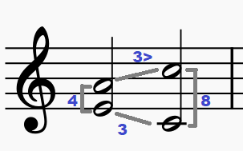

# Music Squares

Android mobile application for ear training. It's a simple puzzle based on recognizing four musical intervals after hearing two chords in succession.

## How it works?

At the beginning you hear two chords, each contains two notes. Your job is to specify both harmonic and melodic intervals that occured in a hearing. Sheet music representation:

